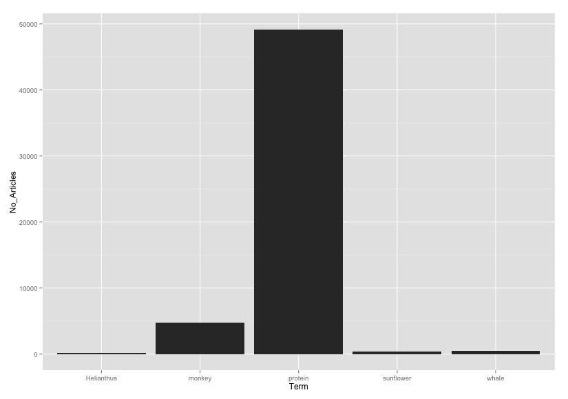

rplos
=====

[](https://travis-ci.org/ropensci/rplos)
[](https://ci.appveyor.com/project/sckott/rplos/branch/master)

### Install

You can get this package at CRAN [here](http://cran.r-project.org/web/packages/rplos/), or install it within R by doing

```r
install.packages("rplos")
```

Or install the development version with `devtools::install_github()`:

```r
install.packages("devtools")
require(devtools)
install_github("rplos", "rOpenSci")
require(rplos)
```

### What is this?

`rplos` is a package for accessing full text articles from the Public Library of Science journals using their API.

### Information

Get your PLoS API key [here](http://alm.plos.org/)

Put your API key in your .Rprofile file using exactly this:
options(PlosApiKey = "YOURPLOSAPIKEY"),
and the functions within this package will be able to use your API key without you having to enter it every time you run a search.

rplos tutorial at rOpenSci website [here](http://ropensci.org/tutorials/rplos_tutorial.html)

PLoS API documentation [here](http://api.plos.org/)

Crossref API documentation [here](https://github.com/CrossRef/rest-api-doc/blob/master/rest_api.md), [here](http://crosstech.crossref.org/2014/04/%E2%99%AB-researchers-just-wanna-have-funds-%E2%99%AB.html), and [here](http://help.crossref.org/#home). Note that we are working on a new package `rcrossref` with a much fuller implementation of R functions for all Crossref endpoints.

### Quick start


#### Search for the term ecology, and return id (DOI) and publication date, limiting to 5 items

```r
searchplos('ecology', 'id,publication_date', limit = 5)
```

```r
                            id     publication_date
1 10.1371/journal.pone.0059813 2013-04-24T00:00:00Z
2 10.1371/journal.pone.0001248 2007-11-28T00:00:00Z
3 10.1371/journal.pone.0017342 2011-03-09T00:00:00Z
4 10.1371/journal.pbio.0020072 2004-03-16T00:00:00Z
5 10.1371/journal.pone.0054689 2013-01-23T00:00:00Z
```

#### Visualize word use across articles

```r
plosword(list('monkey','Helianthus','sunflower','protein','whale'), vis = 'TRUE')
```



## Meta

* Please report any [issues or bugs](https://github.com/ropensci/rplos/issues).
* License: CC0
* Get citation information for `rplos` in R doing `citation(package = 'rplos')`

---

This package is part of a richer suite called [fulltext](https://github.com/ropensci/fulltext), along with several other packages, that provides the ability to search for and retrieve full text of open access scholarly articles. We recommend using `fulltext` as the primary R interface to `rplos` unless your needs are limited to this single source.

---

[](http://ropensci.org)
