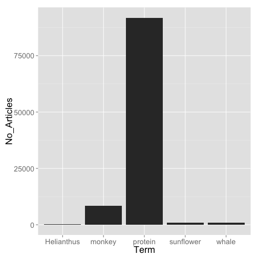

rplos
=====


[](https://travis-ci.org/ropensci/rplos)
[](https://ci.appveyor.com/project/sckott/rplos/branch/master)
[](https://codecov.io/github/ropensci/rplos?branch=master)
[](https://github.com/metacran/cranlogs.app)
[](https://cran.r-project.org/package=rplos)

## Install

You can get this package at CRAN [here](https://cran.r-project.org/package=rplos), or install it within R by doing


```r
install.packages("rplos")
```

Or install the development version from GitHub


```r
install.packages("devtools")
devtools::install_github("ropensci/rplos")
```


```r
library("rplos")
```

## What is this?

`rplos` is a package for accessing full text articles from the Public Library of Science journals using their API.

## Information

You used to need a key to use `rplos` - you no longer do as of 2015-01-13 (or `v0.4.5.999`).

rplos tutorial at rOpenSci website [here](http://ropensci.org/tutorials/rplos_tutorial.html)

PLoS API documentation [here](http://api.plos.org/)

Crossref API documentation [here](https://github.com/CrossRef/rest-api-doc/blob/master/rest_api.md), and [here](http://help.crossref.org/#home). Note that we are working on a new package [rcrossref](https://github.com/ropensci/rcrossref) ([on CRAN](https://cran.r-project.org/package=rcrossref)) with a much fuller implementation of R functions for all Crossref endpoints.

## Quick start

### Search

Search for the term ecology, and return id (DOI) and publication date, limiting to 5 items


```r
searchplos('ecology', 'id,publication_date', limit = 5)
#> $meta
#>   numFound start maxScore
#> 1    36908     0       NA
#> 
#> $data
#>                             id     publication_date
#> 1 10.1371/journal.pone.0059813 2013-04-24T00:00:00Z
#> 2 10.1371/journal.pone.0001248 2007-11-28T00:00:00Z
#> 3 10.1371/journal.pone.0080763 2013-12-10T00:00:00Z
#> 4 10.1371/journal.pone.0155019 2016-05-11T00:00:00Z
#> 5 10.1371/journal.pone.0102437 2014-07-22T00:00:00Z
```

Get DOIs for full article in PLoS One


```r
searchplos(q="*:*", fl='id', fq=list('journal_key:PLoSONE',
   'doc_type:full'), limit=5)
#> $meta
#>   numFound start maxScore
#> 1   167954     0       NA
#> 
#> $data
#>                             id
#> 1 10.1371/journal.pone.0130089
#> 2 10.1371/journal.pone.0165670
#> 3 10.1371/journal.pone.0162873
#> 4 10.1371/journal.pone.0163015
#> 5 10.1371/journal.pone.0167202
```

Query to get some PLOS article-level metrics, notice difference between two outputs


```r
out <- searchplos(q="*:*", fl=c('id','counter_total_all','alm_twitterCount'), fq='doc_type:full')
out_sorted <- searchplos(q="*:*", fl=c('id','counter_total_all','alm_twitterCount'),
   fq='doc_type:full', sort='counter_total_all desc')
head(out$data)
#>                             id alm_twitterCount counter_total_all
#> 1 10.1371/journal.pcbi.1000942                0              2388
#> 2 10.1371/journal.pone.0130089               11              1942
#> 3 10.1371/journal.pone.0165670                0               202
#> 4 10.1371/journal.pgen.1002909                2              2858
#> 5 10.1371/journal.pcbi.1004317                8              2818
#> 6 10.1371/journal.pbio.1002259                0              2652
head(out_sorted$data)
#>                             id alm_twitterCount counter_total_all
#> 1 10.1371/journal.pmed.0020124             2859           1984822
#> 2 10.1371/journal.pone.0141854             3105            733371
#> 3 10.1371/journal.pcbi.1003149              153            567900
#> 4 10.1371/journal.pcbi.0030102               57            539980
#> 5 10.1371/journal.pone.0069841              871            447379
#> 6 10.1371/journal.pone.0088278              891            427864
```

A list of articles about social networks that are popular on a social network


```r
searchplos(q="*:*",fl=c('id','alm_twitterCount'),
   fq=list('doc_type:full','subject:"Social networks"','alm_twitterCount:[100 TO 10000]'),
   sort='counter_total_month desc')
#> $meta
#>   numFound start maxScore
#> 1       51     0       NA
#> 
#> $data
#>                              id alm_twitterCount
#> 1  10.1371/journal.pone.0069841              871
#> 2  10.1371/journal.pone.0171774              163
#> 3  10.1371/journal.pmed.1000316              963
#> 4  10.1371/journal.pone.0073791             1721
#> 5  10.1371/journal.pone.0148405              497
#> 6  10.1371/journal.pone.0151588              321
#> 7  10.1371/journal.pbio.1001535             1933
#> 8  10.1371/journal.pone.0168895              148
#> 9  10.1371/journal.pone.0090315              440
#> 10 10.1371/journal.pone.0150989              237
```

Show all articles that have these two words less then about 15 words apart


```r
searchplos(q='everything:"sports alcohol"~15', fl='title', fq='doc_type:full', limit=3)
#> $meta
#>   numFound start maxScore
#> 1      117     0       NA
#> 
#> $data
#>                                                                                                                                                               title
#> 1                                                                       Alcohol Advertising in Sport and Non-Sport TV in Australia, during Children’s Viewing Times
#> 2 The Effect of Significant International Sports Events on Qualified Detoxification Treatment Outcome - Do Drop-Out Rates Change during UEFA European Championship?
#> 3         Symptoms of Insomnia and Sleep Duration and Their Association with Incident Strokes: Findings from the Population-Based MONICA/KORA Augsburg Cohort Study
```

Narrow results to 7 words apart, changing the ~15 to ~7


```r
searchplos(q='everything:"sports alcohol"~7', fl='title', fq='doc_type:full', limit=3)
#> $meta
#>   numFound start maxScore
#> 1       62     0       NA
#> 
#> $data
#>                                                                                                                                                               title
#> 1                                                                       Alcohol Advertising in Sport and Non-Sport TV in Australia, during Children’s Viewing Times
#> 2 The Effect of Significant International Sports Events on Qualified Detoxification Treatment Outcome - Do Drop-Out Rates Change during UEFA European Championship?
#> 3         Symptoms of Insomnia and Sleep Duration and Their Association with Incident Strokes: Findings from the Population-Based MONICA/KORA Augsburg Cohort Study
```

Remove DOIs for annotations (i.e., corrections) and Viewpoints articles


```r
searchplos(q='*:*', fl=c('id','article_type'),
   fq=list('-article_type:correction','-article_type:viewpoints'), limit=5)
#> $meta
#>   numFound start maxScore
#> 1  1705775     0       NA
#> 
#> $data
#>                                          id     article_type
#> 1        10.1371/journal.pcbi.1000942/title Research Article
#> 2     10.1371/journal.pcbi.1000942/abstract Research Article
#> 3   10.1371/journal.pcbi.1000942/references Research Article
#> 4         10.1371/journal.pcbi.1000942/body Research Article
#> 5 10.1371/journal.pcbi.1000942/introduction Research Article
```

### Faceted search

Facet on multiple fields


```r
facetplos(q='alcohol', facet.field=c('journal','subject'), facet.limit=5)
#> $facet_queries
#> NULL
#> 
#> $facet_fields
#> $facet_fields$journal
#>                                 X1      X2
#> 1                         plos one 1407216
#> 2                    plos genetics   54150
#> 3                   plos pathogens   47708
#> 4       plos computational biology   41170
#> 5 plos neglected tropical diseases   41072
#> 
#> $facet_fields$subject
#>                              X1      X2
#> 1     biology and life sciences 1630484
#> 2  medicine and health sciences 1273984
#> 3 research and analysis methods 1067048
#> 4                  biochemistry  792385
#> 5                  cell biology  673604
#> 
#> 
#> $facet_dates
#> NULL
#> 
#> $facet_ranges
#> NULL
```

Range faceting


```r
facetplos(q='*:*', url=url, facet.range='counter_total_all',
 facet.range.start=5, facet.range.end=100, facet.range.gap=10)
#> $facet_queries
#> NULL
#> 
#> $facet_fields
#> NULL
#> 
#> $facet_dates
#> NULL
#> 
#> $facet_ranges
#> $facet_ranges$counter_total_all
#>    X1  X2
#> 1   5   0
#> 2  15   0
#> 3  25   9
#> 4  35  52
#> 5  45 242
#> 6  55 256
#> 7  65 219
#> 8  75 228
#> 9  85 168
#> 10 95 253
```

### Highlight searches

Search for and highlight the term _alcohol_ in the abstract field only


```r
(out <- highplos(q='alcohol', hl.fl = 'abstract', rows=3))
#> $`10.1371/journal.pmed.0040151`
#> $`10.1371/journal.pmed.0040151`$abstract
#> [1] "Background: <em>Alcohol</em> consumption causes an estimated 4% of the global disease burden, prompting"
#> 
#> 
#> $`10.1371/journal.pone.0027752`
#> $`10.1371/journal.pone.0027752`$abstract
#> [1] "Background: The negative influences of <em>alcohol</em> on TB management with regard to delays in seeking"
#> 
#> 
#> $`10.1371/journal.pmed.0050108`
#> $`10.1371/journal.pmed.0050108`$abstract
#> [1] " study that links retail <em>alcohol</em> sales and violent assaults.\n      "
```

And you can browse the results in your default browser


```r
highbrow(out)
```


### Full text urls

Simple function to get full text urls for a DOI


```r
full_text_urls(doi='10.1371/journal.pone.0086169')
#> [1] "http://journals.plos.org/plosone/article/file?id=10.1371/journal.pone.0086169&type=manuscript"
```

### Full text xml given a DOI


```r
(out <- plos_fulltext(doi='10.1371/journal.pone.0086169'))
#> 1 full-text articles retrieved 
#> Min. Length: 110717 - Max. Length: 110717 
#> DOIs: 10.1371/journal.pone.0086169 ... 
#> 
#> NOTE: extract xml strings like output['<doi>']
```

Then parse the XML any way you like, here getting the abstract


```r
library("XML")
xpathSApply(xmlParse(out$`10.1371/journal.pone.0086169`), "//abstract", xmlValue)
#> [1] "Mammalian females pay high energetic costs for reproduction, the greatest of which is imposed by lactation. The synthesis of milk requires, in part, the mobilization of bodily reserves to nourish developing young. Numerous hypotheses have been advanced to predict how mothers will differentially invest in sons and daughters, however few studies have addressed sex-biased milk synthesis. Here we leverage the dairy cow model to investigate such phenomena. Using 2.39 million lactation records from 1.49 million dairy cows, we demonstrate that the sex of the fetus influences the capacity of the mammary gland to synthesize milk during lactation. Cows favor daughters, producing significantly more milk for daughters than for sons across lactation. Using a sub-sample of this dataset (N = 113,750 subjects) we further demonstrate that the effects of fetal sex interact dynamically across parities, whereby the sex of the fetus being gestated can enhance or diminish the production of milk during an established lactation. Moreover the sex of the fetus gestated on the first parity has persistent consequences for milk synthesis on the subsequent parity. Specifically, gestation of a daughter on the first parity increases milk production by ∼445 kg over the first two lactations. Our results identify a dramatic and sustained programming of mammary function by offspring in utero. Nutritional and endocrine conditions in utero are known to have pronounced and long-term effects on progeny, but the ways in which the progeny has sustained physiological effects on the dam have received little attention to date."
```

### Search within a field

There are a series of convience functions for searching within sections of articles.

* `plosauthor()`
* `plosabstract()`
* `plosfigtabcaps()`
* `plostitle()`
* `plossubject()`

For example:


```r
plossubject(q='marine ecology',  fl = c('id','journal'), limit = 10)
#> $meta
#>   numFound start maxScore
#> 1     3493     0       NA
#> 
#> $data
#>                                                     id  journal
#> 1                         10.1371/journal.pone.0149852 PLOS ONE
#> 2                   10.1371/journal.pone.0149852/title PLOS ONE
#> 3                10.1371/journal.pone.0149852/abstract PLOS ONE
#> 4              10.1371/journal.pone.0149852/references PLOS ONE
#> 5                    10.1371/journal.pone.0149852/body PLOS ONE
#> 6            10.1371/journal.pone.0149852/introduction PLOS ONE
#> 7  10.1371/journal.pone.0149852/results_and_discussion PLOS ONE
#> 8   10.1371/journal.pone.0149852/materials_and_methods PLOS ONE
#> 9  10.1371/journal.pone.0149852/supporting_information PLOS ONE
#> 10 10.1371/journal.pone.0080365/results_and_discussion PLoS ONE
```

However, you can always just do this in `searchplos()` like `searchplos(q = "subject:science")`. See also the `fq` parameter. The above convenience functions are simply wrappers around `searchplos`, so take all the same parameters.

### Search by article views

Search with term _marine ecology_, by field _subject_, and limit to 5 results


```r
plosviews(search='marine ecology', byfield='subject', limit=5)
#>                             id counter_total_all
#> 3 10.1371/journal.pone.0080365              2203
#> 4 10.1371/journal.pone.0021810              2581
#> 1 10.1371/journal.pone.0149852              5941
#> 2 10.1371/journal.pone.0092590              8007
#> 5 10.1371/journal.pbio.1000131             42699
```

### Visualize

Visualize word use across articles


```r
plosword(list('monkey','Helianthus','sunflower','protein','whale'), vis = 'TRUE')
#> $table
#>   No_Articles       Term
#> 1       11163     monkey
#> 2         466 Helianthus
#> 3        1285  sunflower
#> 4      125467    protein
#> 5        1465      whale
#> 
#> $plot
```



## Meta

* Please [report any issues or bugs](https://github.com/ropensci/rplos/issues).
* License: MIT
* Get citation information for `rplos` in R doing `citation(package = 'rplos')`

---

This package is part of a richer suite called [fulltext](https://github.com/ropensci/fulltext), along with several other packages, that provides the ability to search for and retrieve full text of open access scholarly articles. We recommend using `fulltext` as the primary R interface to `rplos` unless your needs are limited to this single source.

---

[](http://ropensci.org)
