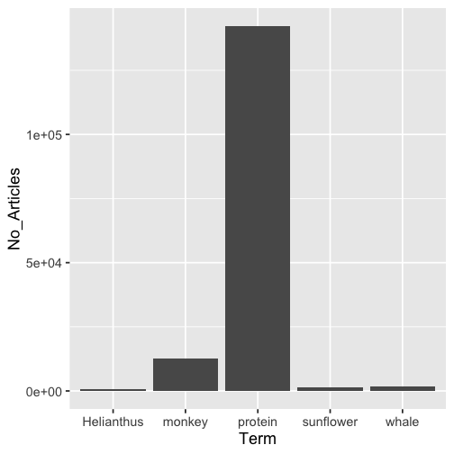

rplos
=====


[](https://travis-ci.org/ropensci/rplos)
[](https://ci.appveyor.com/project/sckott/rplos)
[](https://codecov.io/github/ropensci/rplos?branch=master)
[](https://github.com/metacran/cranlogs.app)
[](https://cran.r-project.org/package=rplos)

## Install

You can get this package at CRAN [here](https://cran.r-project.org/package=rplos), or install it within R by doing


```r
install.packages("rplos")
```

Or install the development version from GitHub


```r
install.packages("devtools")
devtools::install_github("ropensci/rplos")
```


```r
library("rplos")
```

## What is this?

`rplos` is a package for accessing full text articles from the Public Library of Science journals using their API.

## Information

You used to need a key to use `rplos` - you no longer do as of 2015-01-13 (or `v0.4.5.999`).

rplos tutorial at rOpenSci website [here](http://ropensci.org/tutorials/rplos_tutorial.html)

PLoS API documentation [here](http://api.plos.org/)

Crossref API documentation [here](https://github.com/CrossRef/rest-api-doc/blob/master/rest_api.md), and [here](http://help.crossref.org/#home). Note that we are working on a new package [rcrossref](https://github.com/ropensci/rcrossref) ([on CRAN](https://cran.r-project.org/package=rcrossref)) with a much fuller implementation of R functions for all Crossref endpoints.

## Throttling

Beware, PLOS recently has started throttling requests. That is,
they will give error messages like "(503) Service Unavailable -
The server cannot process the request due to a high load", which
means you've done too many requests in a certain time period. Here's
[what they say](http://api.plos.org/solr/faq/#solr_api_recommended_usage) on the matter:

> Please limit your API requests to 7200 requests a day, 300 per hour, 10 per minute and allow 5 seconds for your search to return results. If you exceed this threshold, we will lock out your IP address. If you're a high-volume user of the PLOS Search API and need more API requests a day, please contact us at api@plos.org to discuss your options. We currently limit API users to no more than five concurrent connections from a single IP address.

## Quick start

### Search

Search for the term ecology, and return id (DOI) and publication date, limiting to 5 items


```r
searchplos('ecology', 'id,publication_date', limit = 5)
#> $meta
#> # A tibble: 1 x 2
#>   numFound start
#>      <int> <int>
#> 1    40530     0
#>
#> $data
#> # A tibble: 5 x 2
#>                             id     publication_date
#>                          <chr>                <chr>
#> 1 10.1371/journal.pone.0001248 2007-11-28T00:00:00Z
#> 2 10.1371/journal.pone.0059813 2013-04-24T00:00:00Z
#> 3 10.1371/journal.pone.0155019 2016-05-11T00:00:00Z
#> 4 10.1371/journal.pone.0080763 2013-12-10T00:00:00Z
#> 5 10.1371/journal.pone.0150648 2016-03-03T00:00:00Z
```

Get DOIs for full article in PLoS One


```r
searchplos(q="*:*", fl='id', fq=list('journal_key:PLoSONE',
   'doc_type:full'), limit=5)
#> $meta
#> # A tibble: 1 x 2
#>   numFound start
#>      <int> <int>
#> 1   189936     0
#>
#> $data
#> # A tibble: 5 x 1
#>                             id
#>                          <chr>
#> 1 10.1371/journal.pone.0107314
#> 2 10.1371/journal.pone.0037802
#> 3 10.1371/journal.pone.0163113
#> 4 10.1371/journal.pone.0079578
#> 5 10.1371/journal.pone.0023759
```

Query to get some PLOS article-level metrics, notice difference between two outputs


```r
out <- searchplos(q="*:*", fl=c('id','counter_total_all','alm_twitterCount'), fq='doc_type:full')
out_sorted <- searchplos(q="*:*", fl=c('id','counter_total_all','alm_twitterCount'),
   fq='doc_type:full', sort='counter_total_all desc')
head(out$data)
#> # A tibble: 6 x 3
#>                             id alm_twitterCount counter_total_all
#>                          <chr>            <int>             <int>
#> 1 10.1371/journal.pone.0107314                0               602
#> 2 10.1371/journal.pone.0037802                0              3743
#> 3 10.1371/journal.pone.0163113                2              2137
#> 4 10.1371/journal.ppat.1004790                0              2819
#> 5 10.1371/journal.pone.0079578                2              3187
#> 6 10.1371/journal.pone.0023759                0              5016
head(out_sorted$data)
#> # A tibble: 6 x 3
#>                                                        id alm_twitterCount
#>                                                     <chr>            <int>
#> 1                            10.1371/journal.pmed.0020124             3207
#> 2 10.1371/annotation/80bd7285-9d2d-403a-8e6f-9c375bf977ca                0
#> 3                            10.1371/journal.pcbi.1003149              182
#> 4                            10.1371/journal.pone.0141854             3401
#> 5                            10.1371/journal.pcbi.0030102               63
#> 6                            10.1371/journal.pone.0088278              932
#> # ... with 1 more variables: counter_total_all <int>
```

A list of articles about social networks that are popular on a social network


```r
searchplos(q="*:*",fl=c('id','alm_twitterCount'),
   fq=list('doc_type:full','subject:"Social networks"','alm_twitterCount:[100 TO 10000]'),
   sort='counter_total_month desc')
#> $meta
#> # A tibble: 1 x 2
#>   numFound start
#>      <int> <int>
#> 1       56     0
#>
#> $data
#> # A tibble: 10 x 2
#>                              id alm_twitterCount
#>                           <chr>            <int>
#>  1 10.1371/journal.pone.0073791             1856
#>  2 10.1371/journal.pmed.1000316             1006
#>  3 10.1371/journal.pone.0069841              892
#>  4 10.1371/journal.pone.0148405              516
#>  5 10.1371/journal.pone.0151588              331
#>  6 10.1371/journal.pcbi.1005399              561
#>  7 10.1371/journal.pone.0149885              167
#>  8 10.1371/journal.pone.0150989              241
#>  9 10.1371/journal.pbio.1001535             2123
#> 10 10.1371/journal.pbio.1002373              402
```

Show all articles that have these two words less then about 15 words apart


```r
searchplos(q='everything:"sports alcohol"~15', fl='title', fq='doc_type:full', limit=3)
#> $meta
#> # A tibble: 1 x 2
#>   numFound start
#>      <int> <int>
#> 1      111     0
#>
#> $data
#> # A tibble: 3 x 1
#>                                                                         title
#>                                                                         <chr>
#> 1 Alcohol Advertising in Sport and Non-Sport TV in Australia, during Children
#> 2 Symptoms of Insomnia and Sleep Duration and Their Association with Incident
#> 3 Correction: Alcohol Advertising in Sport and Non-Sport TV in Australia, dur
```

Narrow results to 7 words apart, changing the ~15 to ~7


```r
searchplos(q='everything:"sports alcohol"~7', fl='title', fq='doc_type:full', limit=3)
#> $meta
#> # A tibble: 1 x 2
#>   numFound start
#>      <int> <int>
#> 1       60     0
#>
#> $data
#> # A tibble: 3 x 1
#>                                                                         title
#>                                                                         <chr>
#> 1 Alcohol Advertising in Sport and Non-Sport TV in Australia, during Children
#> 2 Symptoms of Insomnia and Sleep Duration and Their Association with Incident
#> 3 Correction: Alcohol Advertising in Sport and Non-Sport TV in Australia, dur
```

Remove DOIs for annotations (i.e., corrections) and Viewpoints articles


```r
searchplos(q='*:*', fl=c('id','article_type'),
   fq=list('-article_type:correction','-article_type:viewpoints'), limit=5)
#> $meta
#> # A tibble: 1 x 2
#>   numFound start
#>      <int> <int>
#> 1  1851430     0
#>
#> $data
#> # A tibble: 5 x 2
#>                                        id     article_type
#>                                     <chr>            <chr>
#> 1            10.1371/journal.pone.0074173 Research Article
#> 2      10.1371/journal.pone.0074173/title Research Article
#> 3   10.1371/journal.pone.0074173/abstract Research Article
#> 4 10.1371/journal.pone.0074173/references Research Article
#> 5       10.1371/journal.pone.0074173/body Research Article
```

### Faceted search

Facet on multiple fields


```r
facetplos(q='alcohol', facet.field=c('journal','subject'), facet.limit=5)
#> $facet_queries
#> NULL
#>
#> $facet_fields
#> $facet_fields$journal
#> # A tibble: 5 x 2
#>                               term value
#>                              <chr> <chr>
#> 1                         plos one 23167
#> 2                    plos genetics   535
#> 3                    plos medicine   452
#> 4 plos neglected tropical diseases   415
#> 5                   plos pathogens   311
#>
#> $facet_fields$subject
#> # A tibble: 5 x 2
#>                            term value
#>                           <chr> <chr>
#> 1     biology and life sciences 24912
#> 2  medicine and health sciences 22173
#> 3 research and analysis methods 14372
#> 4                  biochemistry 12309
#> 5             physical sciences  9342
#>
#>
#> $facet_pivot
#> NULL
#>
#> $facet_dates
#> NULL
#>
#> $facet_ranges
#> NULL
```

Range faceting


```r
facetplos(q='*:*', url=url, facet.range='counter_total_all',
 facet.range.start=5, facet.range.end=100, facet.range.gap=10)
#> $facet_queries
#> NULL
#>
#> $facet_fields
#> NULL
#>
#> $facet_pivot
#> NULL
#>
#> $facet_dates
#> NULL
#>
#> $facet_ranges
#> $facet_ranges$counter_total_all
#> # A tibble: 10 x 2
#>     term value
#>    <chr> <chr>
#>  1     5    25
#>  2    15   239
#>  3    25   509
#>  4    35   927
#>  5    45  1409
#>  6    55  1709
#>  7    65  1830
#>  8    75  1726
#>  9    85  1595
#> 10    95  1464
```

### Highlight searches

Search for and highlight the term _alcohol_ in the abstract field only


```r
(out <- highplos(q='alcohol', hl.fl = 'abstract', rows=3))
#> $`10.1371/journal.pone.0185457`
#> $`10.1371/journal.pone.0185457`$abstract
#> [1] "Objectives: <em>Alcohol</em>-related morbidity and mortality are significant public health issues"
#>
#>
#> $`10.1371/journal.pone.0071284`
#> $`10.1371/journal.pone.0071284`$abstract
#> [1] "\n<em>Alcohol</em> dependence is a heterogeneous disorder where several signalling systems play important"
#>
#>
#> $`10.1371/journal.pone.0027752`
#> $`10.1371/journal.pone.0027752`$abstract
#> [1] "Background: The negative influences of <em>alcohol</em> on TB management with regard to delays in seeking"
```

And you can browse the results in your default browser


```r
highbrow(out)
```


### Full text urls

Simple function to get full text urls for a DOI


```r
full_text_urls(doi='10.1371/journal.pone.0086169')
#> [1] "http://journals.plos.org/plosone/article/file?id=10.1371/journal.pone.0086169&type=manuscript"
```

### Full text xml given a DOI


```r
(out <- plos_fulltext(doi='10.1371/journal.pone.0086169'))
#> 1 full-text articles retrieved
#> Min. Length: 110717 - Max. Length: 110717
#> DOIs: 10.1371/journal.pone.0086169 ...
#>
#> NOTE: extract xml strings like output['<doi>']
```

Then parse the XML any way you like, here getting the abstract


```r
library("XML")
xpathSApply(xmlParse(out$`10.1371/journal.pone.0086169`), "//abstract", xmlValue)
#> [1] "Mammalian females pay high energetic costs for reproduction, the greatest of which is imposed by lactation. The synthesis of milk requires, in part, the mobilization of bodily reserves to nourish developing young. Numerous hypotheses have been advanced to predict how mothers will differentially invest in sons and daughters, however few studies have addressed sex-biased milk synthesis. Here we leverage the dairy cow model to investigate such phenomena. Using 2.39 million lactation records from 1.49 million dairy cows, we demonstrate that the sex of the fetus influences the capacity of the mammary gland to synthesize milk during lactation. Cows favor daughters, producing significantly more milk for daughters than for sons across lactation. Using a sub-sample of this dataset (N = 113,750 subjects) we further demonstrate that the effects of fetal sex interact dynamically across parities, whereby the sex of the fetus being gestated can enhance or diminish the production of milk during an established lactation. Moreover the sex of the fetus gestated on the first parity has persistent consequences for milk synthesis on the subsequent parity. Specifically, gestation of a daughter on the first parity increases milk production by ∼445 kg over the first two lactations. Our results identify a dramatic and sustained programming of mammary function by offspring in utero. Nutritional and endocrine conditions in utero are known to have pronounced and long-term effects on progeny, but the ways in which the progeny has sustained physiological effects on the dam have received little attention to date."
```

### Search within a field

There are a series of convience functions for searching within sections of articles.

* `plosauthor()`
* `plosabstract()`
* `plosfigtabcaps()`
* `plostitle()`
* `plossubject()`

For example:


```r
plossubject(q='marine ecology',  fl = c('id','journal'), limit = 10)
#> $meta
#> # A tibble: 1 x 2
#>   numFound start
#>      <int> <int>
#> 1     3560     0
#>
#> $data
#> # A tibble: 10 x 2
#>                                         id  journal
#>                                      <chr>    <chr>
#>  1            10.1371/journal.pone.0167252 PLOS ONE
#>  2      10.1371/journal.pone.0167252/title PLOS ONE
#>  3   10.1371/journal.pone.0167252/abstract PLOS ONE
#>  4 10.1371/journal.pone.0167252/references PLOS ONE
#>  5       10.1371/journal.pone.0167252/body PLOS ONE
#>  6            10.1371/journal.pone.0021810 PLoS ONE
#>  7      10.1371/journal.pone.0021810/title PLoS ONE
#>  8   10.1371/journal.pone.0021810/abstract PLoS ONE
#>  9 10.1371/journal.pone.0021810/references PLoS ONE
#> 10       10.1371/journal.pone.0021810/body PLoS ONE
```

However, you can always just do this in `searchplos()` like `searchplos(q = "subject:science")`. See also the `fq` parameter. The above convenience functions are simply wrappers around `searchplos`, so take all the same parameters.

### Search by article views

Search with term _marine ecology_, by field _subject_, and limit to 5 results


```r
plosviews(search='marine ecology', byfield='subject', limit=5)
#>                             id counter_total_all
#> 1 10.1371/journal.pone.0167252              1379
#> 2 10.1371/journal.pone.0021810              2883
#> 5 10.1371/journal.pone.0053598              4351
#> 4 10.1371/journal.pone.0149852              8319
#> 3 10.1371/journal.pone.0092590              8873
```

### Visualize

Visualize word use across articles


```r
plosword(list('monkey','Helianthus','sunflower','protein','whale'), vis = 'TRUE')
#> $table
#>   No_Articles       Term
#> 1       11884     monkey
#> 2         502 Helianthus
#> 3        1394  sunflower
#> 4      135029    protein
#> 5        1613      whale
#>
#> $plot
```



## Meta

* Please [report any issues or bugs](https://github.com/ropensci/rplos/issues).
* License: MIT
* Get citation information for `rplos` in R doing `citation(package = 'rplos')`
* Please note that this project is released with a [Contributor Code of Conduct](CONDUCT.md).
By participating in this project you agree to abide by its terms.

---

This package is part of a richer suite called [fulltext](https://github.com/ropensci/fulltext), along with several other packages, that provides the ability to search for and retrieve full text of open access scholarly articles. We recommend using `fulltext` as the primary R interface to `rplos` unless your needs are limited to this single source.

---

[](https://ropensci.org)
