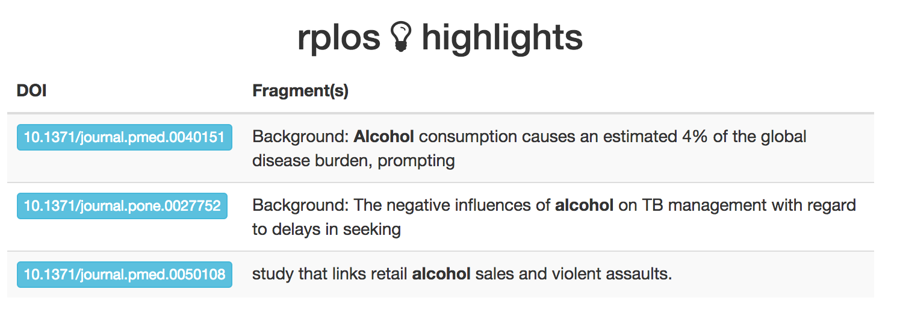

<!--
%\VignetteEngine{knitr::knitr}
%\VignetteIndexEntry{Faceted and highlighted searches}
-->

Faceted and highlighted searches
=====

```{r echo=FALSE}
knitr::opts_chunk$set(
  comment = "#>", 
  warning = FALSE, 
  message = FALSE
)
```

In addition to `searchplos()` and related searching functions, there are a few slightly different ways to search: faceting and highlighted searches. Faceting allows you to ask, e.g., how many articles are published in each of the PLOS journals. Highlighting allows you to ask, e.g., highlight terms that I search for in the text results given back, which can make downstream processing easier, and help visualize search results (see `highbrow()` below). 

### Load package from CRAN

```{r eval=FALSE}
install.packages("rplos")
```

```{r}
library('rplos')
```

### Faceted search

Facet by journal

```{r facet1}
facetplos(q='*:*', facet.field='journal')
```

Using `facet.query` to get counts

```{r facet2}
facetplos(q='*:*', facet.field='journal', facet.query='cell,bird')
```

Date faceting

```{r facet3}
facetplos(q='*:*', url=url, facet.date='publication_date',
  facet.date.start='NOW/DAY-5DAYS', facet.date.end='NOW', facet.date.gap='+1DAY')
```

### Highlighted search

Search for the term _alcohol_ in the abstracts of articles, return only 10 results

```{r high1}
highplos(q='alcohol', hl.fl = 'abstract', rows=2)
```

Search for the term _alcohol_ in the abstracts of articles, and return fragment size of 20 characters, return only 5 results

```{r high2}
highplos(q='alcohol', hl.fl='abstract', hl.fragsize=20, rows=2)
```

Search for the term _experiment_ across all sections of an article, return id (DOI) and title fl only, search in full articles only (via `fq='doc_type:full'`), and return only 10 results

```{r high3}
highplos(q='everything:"experiment"', fl='id,title', fq='doc_type:full',
   rows=2)
```

### Visualize highligted searches

Browse highlighted fragments in your default browser

This first examle, we only looko at 10 results

```{r eval=FALSE}
out <- highplos(q='alcohol', hl.fl = 'abstract', rows=10)
highbrow(out)
```



But it works quickly with lots of results too

```{r eval=FALSE}
out <- highplos(q='alcohol', hl.fl = 'abstract', rows=1200)
highbrow(out)
```


