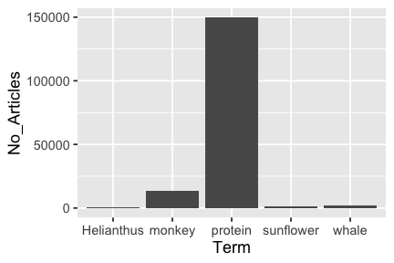
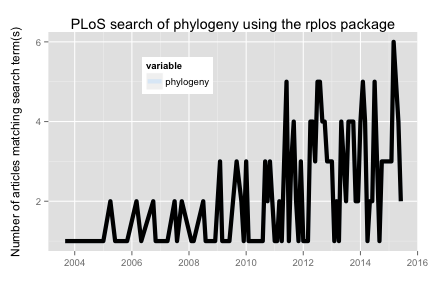

<!--
%\VignetteEngine{knitr::knitr}
%\VignetteIndexEntry{rplos introduction}
%\VignetteEncoding{UTF-8}
-->

rplos introduction
=====


The `rplos` package interacts with the API services of [PLoS](http://www.plos.org/) (Public Library of Science) Journals. You used to need an API key to work with this package - that is no longer needed!

This tutorial will go through three use cases to demonstrate the kinds
of things possible in `rplos`.

* Search across PLoS papers in various sections of papers
* Search for terms and visualize results as a histogram OR as a plot through time
* Text mining of scientific literature

### Load package from CRAN


```r
install.packages("rplos")
```


```r
library('rplos')
```

### Search across PLoS papers in various sections of papers

`searchplos` is a general search, and in this case searches for the term
**Helianthus** and returns the DOI's of matching papers


```r
searchplos(q= "Helianthus", fl= "id", limit = 5)
```

```
#> $meta
#>   numFound start maxScore
#> 1      347     0       NA
#> 
#> $data
#>                             id
#> 1 10.1371/journal.pone.0111982
#> 2 10.1371/journal.pone.0057533
#> 3 10.1371/journal.pone.0045899
#> 4 10.1371/journal.pone.0037191
#> 5 10.1371/journal.pone.0051360
```

Get only full article DOIs


```r
searchplos(q="*:*", fl='id', fq='doc_type:full', start=0, limit=5)
```

```
#> $meta
#>   numFound start maxScore
#> 1   158745     0       NA
#> 
#> $data
#>                             id
#> 1 10.1371/journal.pone.0031384
#> 2 10.1371/journal.pone.0031385
#> 3 10.1371/journal.pone.0107441
#> 4 10.1371/journal.pone.0000339
#> 5 10.1371/journal.pone.0046739
```

Get DOIs for only PLoS One articles


```r
searchplos(q="*:*", fl='id', fq='cross_published_journal_key:PLoSONE', start=0, limit=5)
```

```
#> $meta
#>   numFound start maxScore
#> 1  1142335     0       NA
#> 
#> $data
#>                                          id
#> 1        10.1371/journal.pone.0123754/title
#> 2     10.1371/journal.pone.0123754/abstract
#> 3   10.1371/journal.pone.0123754/references
#> 4         10.1371/journal.pone.0123754/body
#> 5 10.1371/journal.pone.0123754/introduction
```

Get DOIs for full article in PLoS One


```r
searchplos(q="*:*", fl='id',
   fq=list('cross_published_journal_key:PLoSONE', 'doc_type:full'),
   start=0, limit=5)
```

```
#> $meta
#>   numFound start maxScore
#> 1   133907     0       NA
#> 
#> $data
#>                             id
#> 1 10.1371/journal.pone.0031384
#> 2 10.1371/journal.pone.0031385
#> 3 10.1371/journal.pone.0107441
#> 4 10.1371/journal.pone.0000339
#> 5 10.1371/journal.pone.0046739
```

Search for many terms


```r
q <- c('ecology','evolution','science')
lapply(q, function(x) searchplos(x, limit=2))
```

```
#> [[1]]
#> [[1]]$meta
#>   numFound start maxScore
#> 1    27832     0       NA
#> 
#> [[1]]$data
#>                             id
#> 1 10.1371/journal.pone.0059813
#> 2 10.1371/journal.pone.0001248
#> 
#> 
#> [[2]]
#> [[2]]$meta
#>   numFound start maxScore
#> 1    46467     0       NA
#> 
#> [[2]]$data
#>                                                        id
#> 1 10.1371/annotation/9773af53-a076-4946-a3f1-83914226c10d
#> 2 10.1371/annotation/c55d5089-ba2f-449d-8696-2bc8395978db
#> 
#> 
#> [[3]]
#> [[3]]$meta
#>   numFound start maxScore
#> 1   134888     0       NA
#> 
#> [[3]]$data
#>                             id
#> 1 10.1371/journal.pbio.0020122
#> 2 10.1371/journal.pbio.1001166
```

### Search on specific sections

A suite of functions were created as light wrappers around `searchplos` as a shorthand to search specific sections of a paper.

* `plosauthor` searchers in authors
* `plosabstract` searches in abstracts
* `plostitle` searches in titles
* `plosfigtabcaps` searches in figure and table captions
* `plossubject` searches in subject areas

`plosauthor` searches across authors, and in this case returns the authors of the matching papers. the fl parameter determines what is returned


```r
plosauthor(q = "Eisen", fl = "author", limit = 5)
```

```
#> $meta
#>   numFound start maxScore
#> 1      764     0       NA
#> 
#> $data
#>             author
#> 1 Jonathan A Eisen
#> 2 Jonathan A Eisen
#> 3 Jonathan A Eisen
#> 4 Jonathan A Eisen
#> 5 Jonathan A Eisen
```

`plosabstract` searches across abstracts, and in this case returns the id and title of the matching papers


```r
plosabstract(q = 'drosophila', fl='id,title', limit = 5)
```

```
#> $meta
#>   numFound start maxScore
#> 1     2669     0       NA
#> 
#> $data
#>                             id
#> 1 10.1371/journal.pbio.0040198
#> 2 10.1371/journal.pbio.0030246
#> 3 10.1371/journal.pone.0012421
#> 4 10.1371/journal.pbio.0030389
#> 5 10.1371/journal.pbio.1000342
#>                                                                       title
#> 1                                                               All for All
#> 2                               School Students as Drosophila Experimenters
#> 3                      Host Range and Specificity of the Drosophila C Virus
#> 4               New Environments Set the Stage for Changing Tastes in Mates
#> 5 Variable Transcription Factor Binding: A Mechanism of Evolutionary Change
```

`plostitle` searches across titles, and in this case returns the title and journal of the matching papers


```r
plostitle(q='drosophila', fl='title,journal', limit=5)
```

```
#> $meta
#>   numFound start maxScore
#> 1     1718     0       NA
#> 
#> $data
#>        journal                                         title
#> 1 PLoS Biology Identification of Drosophila MicroRNA Targets
#> 2     PLoS ONE                     A DNA Virus of Drosophila
#> 3 PLoS Biology   School Students as Drosophila Experimenters
#> 4 PLoS Biology   Expression in Aneuploid Drosophila S2 Cells
#> 5     PLoS ONE   Quantification of Food Intake in Drosophila
```

### Search for terms and visualize results as a histogram OR as a plot through time

`plosword` allows you to search for 1 to K words and visualize the results
as a histogram, comparing number of matching papers for each word


```r
out <- plosword(list("monkey", "Helianthus", "sunflower", "protein", "whale"),
    vis = "TRUE")
out$table
```

```
#>   No_Articles       Term
#> 1        9098     monkey
#> 2         347 Helianthus
#> 3         937  sunflower
#> 4      101040    protein
#> 5        1139      whale
```


```r
out$plot
```

 

You can also pass in curl options, in this case get verbose information on the curl call.


```r
plosword('Helianthus', callopts=list(verbose=TRUE))
```

```
#> Number of articles with search term 
#>                                 347
```

### Visualize terms

`plot_throughtime` allows you to search for up to 2 words and visualize the results as a line plot through time, comparing number of articles matching through time. Visualize with the ggplot2 package, only up to two terms for now.


```r
plot_throughtime(terms = "phylogeny", limit = 200) + geom_line(size=2, color='black')
```

 

### More

See the _Faceted and highlighted searches_ and _Full text_ vignettes for more `rplos` help.
