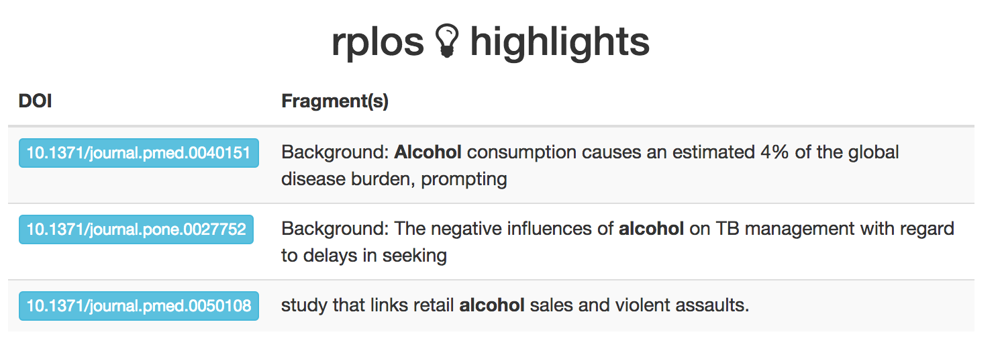
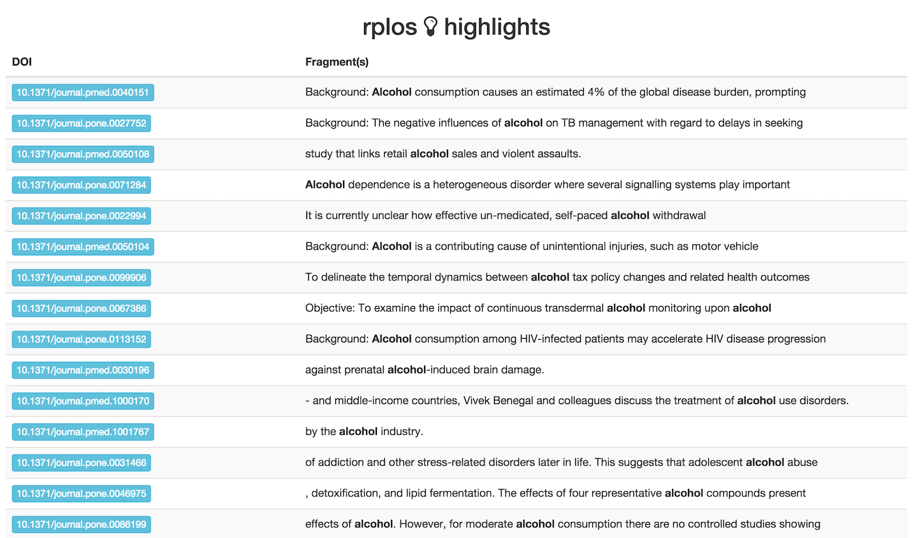

In addition to `searchplos()` and related searching functions, there are a 
few slightly different ways to search: faceting and highlighted searches. 
Faceting allows you to ask, e.g., how many articles are published in each of 
the PLOS journals. Highlighting allows you to ask, e.g., highlight terms that 
I search for in the text results given back, which can make downstream 
processing easier, and help visualize search results (see `highbrow()` below). 

### Load package from CRAN


```r
install.packages("rplos")
```


```r
library('rplos')
```

### Faceted search

Facet by journal


```r
facetplos(q='*:*', facet.field='journal')
```

```
#> $facet_queries
#> NULL
#> 
#> $facet_fields
#> $facet_fields$journal
#> # A tibble: 9 x 2
#>   term                             value  
#>   <chr>                            <chr>  
#> 1 plos one                         2073767
#> 2 plos genetics                    77191  
#> 3 plos neglected tropical diseases 72937  
#> 4 plos pathogens                   71789  
#> 5 plos computational biology       66404  
#> 6 plos biology                     44593  
#> 7 plos medicine                    32612  
#> 8 plos clinical trials             521    
#> 9 plos medicin                     9      
#> 
#> 
#> $facet_pivot
#> NULL
#> 
#> $facet_dates
#> NULL
#> 
#> $facet_ranges
#> NULL
```

Using `facet.query` to get counts


```r
facetplos(q='*:*', facet.field='journal', facet.query='cell,bird')
```

```
#> $facet_queries
#> # A tibble: 1 x 2
#>   term      value
#>   <chr>     <int>
#> 1 cell,bird 12052
#> 
#> $facet_fields
#> $facet_fields$journal
#> # A tibble: 9 x 2
#>   term                             value  
#>   <chr>                            <chr>  
#> 1 plos one                         2073767
#> 2 plos genetics                    77191  
#> 3 plos neglected tropical diseases 72937  
#> 4 plos pathogens                   71789  
#> 5 plos computational biology       66404  
#> 6 plos biology                     44593  
#> 7 plos medicine                    32612  
#> 8 plos clinical trials             521    
#> 9 plos medicin                     9      
#> 
#> 
#> $facet_pivot
#> NULL
#> 
#> $facet_dates
#> NULL
#> 
#> $facet_ranges
#> NULL
```

Date faceting


```r
facetplos(q='*:*', url=url, facet.date='publication_date',
  facet.date.start='NOW/DAY-5DAYS', facet.date.end='NOW', 
  facet.date.gap='+1DAY')
```

```
#> list()
```

### Highlighted search

Search for the term _alcohol_ in the abstracts of articles, return only 
10 results


```r
highplos(q='alcohol', hl.fl = 'abstract', rows=2)
```

```
#> $`10.1371/journal.pone.0218147`
#> $`10.1371/journal.pone.0218147`$abstract
#> [1] "Background: Binge drinking, an increasingly common form of <em>alcohol</em> use disorder, is associated"
#> 
#> 
#> $`10.1371/journal.pone.0138021`
#> $`10.1371/journal.pone.0138021`$abstract
#> [1] "Background and Aim: Harmful <em>alcohol</em> consumption has long been recognized as being the major"
```

Search for the term _alcohol_ in the abstracts of articles, and return 
fragment size of 20 characters, return only 5 results


```r
highplos(q='alcohol', hl.fl='abstract', hl.fragsize=20, rows=2)
```

```
#> $`10.1371/journal.pone.0218147`
#> $`10.1371/journal.pone.0218147`$abstract
#> [1] " common form of <em>alcohol</em>"
#> 
#> 
#> $`10.1371/journal.pone.0138021`
#> $`10.1371/journal.pone.0138021`$abstract
#> [1] ": Harmful <em>alcohol</em>"
```

Search for the term _experiment_ across all sections of an article, return 
id (DOI) and title fl only, search in full articles only 
(via `fq='doc_type:full'`), and return only 10 results


```r
highplos(q='everything:"experiment"', fl='id,title', fq='doc_type:full',
   rows=2)
```

```
#> $`10.1371/journal.pone.0154334`
#> $`10.1371/journal.pone.0154334`$everything
#> [1] " and designed the <em>experiments</em>: RJ CM AOC. Performed the <em>experiments</em>: RJ AOC. Analyzed the data: RJ. Contributed"
#> 
#> 
#> $`10.1371/journal.pone.0039681`
#> $`10.1371/journal.pone.0039681`$everything
#> [1] " Selection of Transcriptomics <em>Experiments</em> Improves Guilt-by-Association Analyses Transcriptomics <em>Experiment</em>"
```

### Visualize highligted searches

Browse highlighted fragments in your default browser

This first examle, we only looko at 10 results


```r
out <- highplos(q='alcohol', hl.fl = 'abstract', rows=10)
highbrow(out)
```



But it works quickly with lots of results too


```r
out <- highplos(q='alcohol', hl.fl = 'abstract', rows=1200)
highbrow(out)
```


