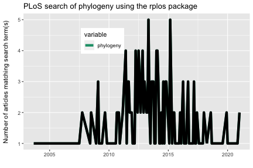

The `rplos` package interacts with the API services of [PLoS](http://www.plos.org/)
(Public Library of Science) Journals. You used to need an API key to work with
this package - that is no longer needed!

This tutorial will go through three use cases to demonstrate the kinds
of things possible in `rplos`.

* Search across PLoS papers in various sections of papers
* Search for terms and visualize results as a histogram OR as a plot through
time
* Text mining of scientific literature

### Load package from CRAN


```r
install.packages("rplos")
```


```r
library('rplos')
```

### Search across PLoS papers in various sections of papers

`searchplos` is a general search, and in this case searches for the term
**Helianthus** and returns the DOI's of matching papers


```r
searchplos(q = "Helianthus", fl = "id", limit = 5)
```

```
#> $meta
#> # A tibble: 1 x 2
#>   numFound start
#>      <int> <int>
#> 1      608     0
#> 
#> $data
#> # A tibble: 5 x 1
#>   id                          
#>   <chr>                       
#> 1 10.1371/journal.pone.0198869
#> 2 10.1371/journal.pone.0213065
#> 3 10.1371/journal.pone.0148280
#> 4 10.1371/journal.pone.0111982
#> 5 10.1371/journal.pone.0212371
```

Get only full article DOIs


```r
searchplos(q = "*:*", fl = 'id', fq = 'doc_type:full', start = 0, limit = 5)
```

```
#> $meta
#> # A tibble: 1 x 2
#>   numFound start
#>      <int> <int>
#> 1   273907     0
#> 
#> $data
#> # A tibble: 5 x 1
#>   id                          
#>   <chr>                       
#> 1 10.1371/journal.pone.0020843
#> 2 10.1371/journal.pone.0022257
#> 3 10.1371/journal.pone.0023139
#> 4 10.1371/journal.pone.0023138
#> 5 10.1371/journal.pone.0023119
```

Get DOIs for only PLoS One articles


```r
searchplos(q = "*:*", fl = 'id', fq = 'journal_key:PLoSONE',
           start = 0, limit = 5)
```

```
#> $meta
#> # A tibble: 1 x 2
#>   numFound start
#>      <int> <int>
#> 1  2001428     0
#> 
#> $data
#> # A tibble: 5 x 1
#>   id                          
#>   <chr>                       
#> 1 10.1371/journal.pone.0020843
#> 2 10.1371/journal.pone.0022257
#> 3 10.1371/journal.pone.0023139
#> 4 10.1371/journal.pone.0023138
#> 5 10.1371/journal.pone.0023119
```

Get DOIs for full article in PLoS One


```r
searchplos(q = "*:*", fl = 'id',
   fq = list('journal_key:PLoSONE', 'doc_type:full'),
   start = 0, limit = 5)
```

```
#> $meta
#> # A tibble: 1 x 2
#>   numFound start
#>      <int> <int>
#> 1   231685     0
#> 
#> $data
#> # A tibble: 5 x 1
#>   id                          
#>   <chr>                       
#> 1 10.1371/journal.pone.0020843
#> 2 10.1371/journal.pone.0022257
#> 3 10.1371/journal.pone.0023139
#> 4 10.1371/journal.pone.0023138
#> 5 10.1371/journal.pone.0023119
```

Search for many terms


```r
q <- c('ecology','evolution','science')
lapply(q, function(x) searchplos(x, limit = 2))
```

```
#> [[1]]
#> [[1]]$meta
#> # A tibble: 1 x 2
#>   numFound start
#>      <int> <int>
#> 1    51686     0
#> 
#> [[1]]$data
#> # A tibble: 2 x 1
#>   id                          
#>   <chr>                       
#> 1 10.1371/journal.pone.0001248
#> 2 10.1371/journal.pone.0059813
#> 
#> 
#> [[2]]
#> [[2]]$meta
#> # A tibble: 1 x 2
#>   numFound start
#>      <int> <int>
#> 1    77101     0
#> 
#> [[2]]$data
#> # A tibble: 2 x 1
#>   id                          
#>   <chr>                       
#> 1 10.1371/journal.pbio.2002255
#> 2 10.1371/journal.pone.0205798
#> 
#> 
#> [[3]]
#> [[3]]$meta
#> # A tibble: 1 x 2
#>   numFound start
#>      <int> <int>
#> 1   241863     0
#> 
#> [[3]]$data
#> # A tibble: 2 x 1
#>   id                          
#>   <chr>                       
#> 1 10.1371/journal.pone.0229237
#> 2 10.1371/journal.pone.0202320
```

### Search on specific sections

A suite of functions were created as light wrappers around `searchplos` as
a shorthand to search specific sections of a paper.

* `plosauthor` searchers in authors
* `plosabstract` searches in abstracts
* `plostitle` searches in titles
* `plosfigtabcaps` searches in figure and table captions
* `plossubject` searches in subject areas

`plosauthor` searches across authors, and in this case returns the authors of
the matching papers. the fl parameter determines what is returned


```r
plosauthor(q = "Eisen", fl = "author", limit = 5)
```

```
#> $meta
#> # A tibble: 1 x 2
#>   numFound start
#>      <int> <int>
#> 1     1077     0
#> 
#> $data
#> # A tibble: 5 x 1
#>   author                                                                       
#>   <chr>                                                                        
#> 1 Myungsun Kang,Timothy J Eisen,Ellen A Eisen,Arup K Chakraborty,Herman N Eisen
#> 2 Myungsun Kang,Timothy J Eisen,Ellen A Eisen,Arup K Chakraborty,Herman N Eisen
#> 3 Myungsun Kang,Timothy J Eisen,Ellen A Eisen,Arup K Chakraborty,Herman N Eisen
#> 4 Myungsun Kang,Timothy J Eisen,Ellen A Eisen,Arup K Chakraborty,Herman N Eisen
#> 5 Myungsun Kang,Timothy J Eisen,Ellen A Eisen,Arup K Chakraborty,Herman N Eisen
```

`plosabstract` searches across abstracts, and in this case returns the id and
title of the matching papers


```r
plosabstract(q = 'drosophila', fl = 'id,title', limit = 5)
```

```
#> $meta
#> # A tibble: 1 x 2
#>   numFound start
#>      <int> <int>
#> 1     3788     0
#> 
#> $data
#> # A tibble: 5 x 2
#>   id                     title                                                  
#>   <chr>                  <chr>                                                  
#> 1 10.1371/journal.pone.… "Host Range and Specificity of the Drosophila C Virus" 
#> 2 10.1371/journal.pone.… "Exogenous expression of Drp1 plays neuroprotective ro…
#> 3 10.1371/journal.pone.… "A Drosophila model for developmental nicotine exposur…
#> 4 10.1371/image.pbio.v0… "PLoS Biology Issue Image | Vol. 6(5) May 2008"        
#> 5 10.1371/journal.pone.… "Larval Defense against Attack from Parasitoid Wasps R…
```

`plostitle` searches across titles, and in this case returns the title and
journal of the matching papers


```r
plostitle(q = 'drosophila', fl = 'title,journal', limit = 5)
```

```
#> $meta
#> # A tibble: 1 x 2
#>   numFound start
#>      <int> <int>
#> 1     2397     0
#> 
#> $data
#> # A tibble: 5 x 2
#>   journal  title                                                                
#>   <chr>    <chr>                                                                
#> 1 PLOS ONE Tandem Duplications and the Limits of Natural Selection in Drosophil…
#> 2 PLoS ONE A DNA Virus of Drosophila                                            
#> 3 PLOS ONE Peptidergic control in a fruit crop pest: The spotted-wing drosophil…
#> 4 PLOS ONE Nematocytes: Discovery and characterization of a novel anculeate hem…
#> 5 PLoS ONE In Vivo RNAi Rescue in Drosophila melanogaster with Genomic Transgen…
```

### Search terms & visualize results as a histogram OR as a plot through time

`plosword` allows you to search for 1 to K words and visualize the results
as a histogram, comparing number of matching papers for each word


```r
out <- plosword(list("monkey", "Helianthus", "sunflower", "protein", "whale"),
    vis = "TRUE")
out$table
```

```
#>   No_Articles       Term
#> 1       13867     monkey
#> 2         608 Helianthus
#> 3        1759  sunflower
#> 4      156937    protein
#> 5        2001      whale
```


```r
out$plot
```


You can also pass in curl options, in this case get verbose information on the
curl call.


```r
plosword('Helianthus', callopts = list(verbose = TRUE))
```

```
#> Number of articles with search term 
#>                                 608
```

### Visualize terms

`plot_throughtime` allows you to search for up to 2 words and visualize the
results as a line plot through time, comparing number of articles matching
through time. Visualize with the ggplot2 package, only up to two terms for now.


```r
library("ggplot2")
plot_throughtime(terms = "phylogeny", limit = 200) +
  geom_line(size = 2, color = 'black')
```



### More

See the _Faceted and highlighted searches_ and _Full text_ vignettes for
more `rplos` help.
