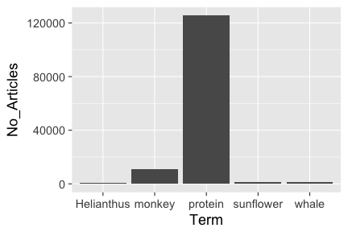
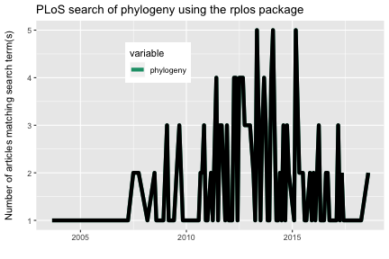

<!--
%\VignetteEngine{knitr::knitr}
%\VignetteIndexEntry{rplos tutorial}
-->

rplos tutorial
=====


The `rplos` package interacts with the API services of [PLoS](http://www.plos.org/) (Public Library of Science) Journals. You used to need an API key to work with this package - that is no longer needed!

This tutorial will go through three use cases to demonstrate the kinds
of things possible in `rplos`.

* Search across PLoS papers in various sections of papers
* Search for terms and visualize results as a histogram OR as a plot through time
* Text mining of scientific literature

### Load package from CRAN


```r
install.packages("rplos")
```


```r
library('rplos')
```

### Search across PLoS papers in various sections of papers

`searchplos` is a general search, and in this case searches for the term
**Helianthus** and returns the DOI's of matching papers


```r
searchplos(q= "Helianthus", fl= "id", limit = 5)
```

```
#> $meta
#>   numFound start maxScore
#> 1      300     0       NA
#> 
#> $data
#>                             id
#> 1 10.1371/journal.pone.0111982
#> 2 10.1371/journal.pone.0057533
#> 3 10.1371/journal.pone.0045899
#> 4 10.1371/journal.pone.0037191
#> 5 10.1371/journal.pone.0051360
```

Get only full article DOIs


```r
searchplos(q="*:*", fl='id', fq='doc_type:full', start=0, limit=5)
```

```
#> $meta
#>   numFound start maxScore
#> 1   142126     0       NA
#> 
#> $data
#>                             id
#> 1 10.1371/journal.pbio.1000156
#> 2 10.1371/journal.pbio.1000106
#> 3 10.1371/journal.pmed.1001197
#> 4 10.1371/journal.pbio.0040294
#> 5 10.1371/journal.pone.0093878
```

Get DOIs for only PLoS One articles


```r
searchplos(q="*:*", fl='id', fq='cross_published_journal_key:PLoSONE', start=0, limit=5)
```

```
#> $meta
#>   numFound start maxScore
#> 1  1013893     0       NA
#> 
#> $data
#>                                        id
#> 1       10.1371/journal.pone.0094673/body
#> 2            10.1371/journal.pone.0093878
#> 3      10.1371/journal.pone.0093878/title
#> 4   10.1371/journal.pone.0093878/abstract
#> 5 10.1371/journal.pone.0093878/references
```

Get DOIs for full article in PLoS One


```r
searchplos(q="*:*", fl='id',
   fq=list('cross_published_journal_key:PLoSONE', 'doc_type:full'),
   start=0, limit=5)
```

```
#> $meta
#>   numFound start maxScore
#> 1   118989     0       NA
#> 
#> $data
#>                             id
#> 1 10.1371/journal.pone.0093878
#> 2 10.1371/journal.pone.0094012
#> 3 10.1371/journal.pone.0094113
#> 4 10.1371/journal.pone.0094154
#> 5 10.1371/journal.pone.0094152
```

Search for many terms


```r
q <- c('ecology','evolution','science')
lapply(q, function(x) searchplos(x, limit=2))
```

```
#> [[1]]
#> [[1]]$meta
#>   numFound start maxScore
#> 1    24936     0       NA
#> 
#> [[1]]$data
#>                             id
#> 1 10.1371/journal.pone.0059813
#> 2 10.1371/journal.pone.0001248
#> 
#> 
#> [[2]]
#> [[2]]$meta
#>   numFound start maxScore
#> 1    42116     0       NA
#> 
#> [[2]]$data
#>                                                        id
#> 1 10.1371/annotation/9773af53-a076-4946-a3f1-83914226c10d
#> 2 10.1371/annotation/c55d5089-ba2f-449d-8696-2bc8395978db
#> 
#> 
#> [[3]]
#> [[3]]$meta
#>   numFound start maxScore
#> 1   121700     0       NA
#> 
#> [[3]]$data
#>                             id
#> 1 10.1371/journal.pbio.0020122
#> 2 10.1371/journal.pbio.1001166
```

### Search on specific sections

A suite of functions were created as light wrappers around `searchplos` as a shorthand to search specific sections of a paper.

* `plosauthor` searchers in authors
* `plosabstract` searches in abstracts
* `plostitle` searches in titles
* `plosfigtabcaps` searches in figure and table captions
* `plossubject` searches in subject areas

`plosauthor` searches across authors, and in this case returns the authors of the matching papers. the fl parameter determines what is returned


```r
plosauthor(q = "Eisen", fl = "author", limit = 5)
```

```
#> $meta
#>   numFound start maxScore
#> 1      741     0       NA
#> 
#> $data
#>             author
#> 1 Jonathan A Eisen
#> 2 Jonathan A Eisen
#> 3 Jonathan A Eisen
#> 4 Jonathan A Eisen
#> 5 Jonathan A Eisen
```

`plosabstract` searches across abstracts, and in this case returns the id and title of the matching papers


```r
plosabstract(q = 'drosophila', fl='id,title', limit = 5)
```

```
#> $meta
#>   numFound start maxScore
#> 1     2498     0       NA
#> 
#> $data
#>                             id
#> 1 10.1371/journal.pbio.0040198
#> 2 10.1371/journal.pbio.0030246
#> 3 10.1371/journal.pone.0012421
#> 4 10.1371/journal.pbio.0030389
#> 5 10.1371/journal.pbio.1000342
#>                                                                       title
#> 1                                                               All for All
#> 2                               School Students as Drosophila Experimenters
#> 3                      Host Range and Specificity of the Drosophila C Virus
#> 4               New Environments Set the Stage for Changing Tastes in Mates
#> 5 Variable Transcription Factor Binding: A Mechanism of Evolutionary Change
```

`plostitle` searches across titles, and in this case returns the title and journal of the matching papers


```r
plostitle(q='drosophila', fl='title,journal', limit=5)
```

```
#> $meta
#>   numFound start maxScore
#> 1     1603     0       NA
#> 
#> $data
#>                      journal
#> 1               PLoS Biology
#> 2              PLoS Genetics
#> 3               PLoS Biology
#> 4                   PLoS ONE
#> 5 PLoS Computational Biology
#>                                                   title
#> 1           School Students as Drosophila Experimenters
#> 2 Phenotypic Plasticity of the Drosophila Transcriptome
#> 3         Identification of Drosophila MicroRNA Targets
#> 4           Quantification of Food Intake in Drosophila
#> 5            Parametric Alignment of Drosophila Genomes
```

### Faceted search

Facet by journal


```r
facetplos(q='*:*', facet.field='journal')
```

```
#> $facet_queries
#> NULL
#> 
#> $facet_fields
#> $facet_fields$journal
#>                                  X1     X2
#> 1                          plos one 955046
#> 2                     plos genetics  41615
#> 3                    plos pathogens  36230
#> 4        plos computational biology  30535
#> 5                      plos biology  26456
#> 6  plos neglected tropical diseases  26120
#> 7                     plos medicine  18672
#> 8              plos clinical trials    521
#> 9                  plos collections     15
#> 10                     plos medicin      9
#> 
#> 
#> $facet_dates
#> NULL
#> 
#> $facet_ranges
#> NULL
```

Using `facet.query` to get counts


```r
facetplos(q='*:*', facet.field='journal', facet.query='cell,bird')
```

```
#> $facet_queries
#>        term value
#> 1 cell,bird    18
#> 
#> $facet_fields
#> $facet_fields$journal
#>                                  X1     X2
#> 1                          plos one 955046
#> 2                     plos genetics  41615
#> 3                    plos pathogens  36230
#> 4        plos computational biology  30535
#> 5                      plos biology  26456
#> 6  plos neglected tropical diseases  26120
#> 7                     plos medicine  18672
#> 8              plos clinical trials    521
#> 9                  plos collections     15
#> 10                     plos medicin      9
#> 
#> 
#> $facet_dates
#> NULL
#> 
#> $facet_ranges
#> NULL
```

Date faceting


```r
facetplos(q='*:*', url=url, facet.date='publication_date',
  facet.date.start='NOW/DAY-5DAYS', facet.date.end='NOW', facet.date.gap='+1DAY')
```

```
#> $facet_queries
#> NULL
#> 
#> $facet_fields
#> NULL
#> 
#> $facet_dates
#> $facet_dates$publication_date
#>                   date value
#> 1 2015-01-17T00:00:00Z     0
#> 2 2015-01-18T00:00:00Z     0
#> 3 2015-01-19T00:00:00Z   406
#> 4 2015-01-20T00:00:00Z   930
#> 5 2015-01-21T00:00:00Z   745
#> 6 2015-01-22T00:00:00Z   221
#> 
#> 
#> $facet_ranges
#> NULL
```

### Highlighted search

Search for the term _alcohol_ in the abstracts of articles, return only 10 results


```r
highplos(q='alcohol', hl.fl = 'abstract', rows=2)
```

```
#> $`10.1371/journal.pmed.0040151`
#> $`10.1371/journal.pmed.0040151`$abstract
#> [1] "Background: <em>Alcohol</em> consumption causes an estimated 4% of the global disease burden, prompting"
#> 
#> 
#> $`10.1371/journal.pone.0027752`
#> $`10.1371/journal.pone.0027752`$abstract
#> [1] "Background: The negative influences of <em>alcohol</em> on TB management with regard to delays in seeking"
```

Search for the term _alcohol_ in the abstracts of articles, and return fragment size of 20 characters, return only 5 results


```r
highplos(q='alcohol', hl.fl='abstract', hl.fragsize=20, rows=2)
```

```
#> $`10.1371/journal.pmed.0040151`
#> $`10.1371/journal.pmed.0040151`$abstract
#> [1] "Background: <em>Alcohol</em>"
#> 
#> 
#> $`10.1371/journal.pone.0027752`
#> $`10.1371/journal.pone.0027752`$abstract
#> [1] " of <em>alcohol</em> on TB management"
```

Search for the term _experiment_ across all sections of an article, return id (DOI) and title fl only, search in full articles only (via `fq='doc_type:full'`), and return only 10 results


```r
highplos(q='everything:"experiment"', fl='id,title', fq='doc_type:full',
   rows=2)
```

```
#> $`10.1371/journal.pone.0039681`
#> $`10.1371/journal.pone.0039681`$everything
#> [1] " Selection of Transcriptomics <em>Experiments</em> Improves Guilt-by-Association Analyses Transcriptomics <em>Experiment</em>"
#> 
#> 
#> $`10.1371/annotation/9b8741e2-0f5f-49f9-9eaa-1b0cb9b8d25f`
#> $`10.1371/annotation/9b8741e2-0f5f-49f9-9eaa-1b0cb9b8d25f`$everything
#> [1] " in the labels under the bars. The labels should read <em>Experiment</em> 3 / <em>Experiment</em> 4 instead of <em>Experiment</em>"
```

### Search for terms and visualize results as a histogram OR as a plot through time

`plosword` allows you to search for 1 to K words and visualize the results
as a histogram, comparing number of matching papers for each word


```r
out <- plosword(list("monkey", "Helianthus", "sunflower", "protein", "whale"),
    vis = "TRUE")
out$table
```

```
#>   No_Articles       Term
#> 1        8335     monkey
#> 2         300 Helianthus
#> 3         818  sunflower
#> 4       91971    protein
#> 5        1023      whale
```


```r
out$plot
```

 

You can also pass in curl options, in this case get verbose information on the curl call.


```r
plosword('Helianthus', callopts=list(verbose=TRUE))
```

```
#> Number of articles with search term 
#>                                 300
```

### Visualize terms

`plot_throughtime` allows you to search for up to 2 words and visualize the results as a line plot through time, comparing number of articles matching through time. Visualize with the ggplot2 package, only up to two terms for now.


```r
plot_throughtime(terms = "phylogeny", limit = 200) + geom_line(size=2, color='black')
```

 
